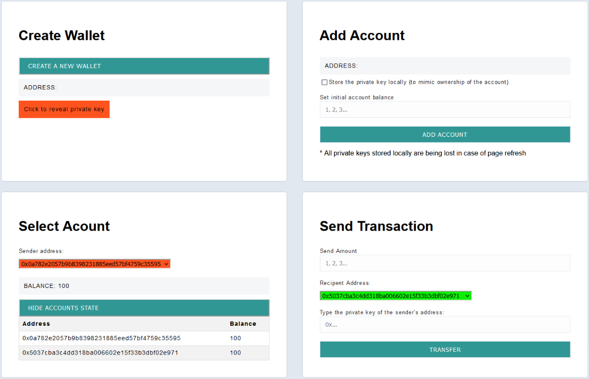

## ECDSA Node

This project is an example of using a client and server to facilitate transfers between different addresses. Since there is just a single server on the back-end handling transfers, this is clearly very centralized. We won't worry about distributed consensus for this project.

### Client

The client folder contains a [react app](https://reactjs.org/) using [vite](https://vitejs.dev/). To get started, follow these steps:

1. Open up a terminal in the `/client` folder
2. Run `npm install` to install all the depedencies
3. Run `npm run dev` to start the application 
4. Now you should be able to visit the app at http://127.0.0.1:5173/

### Server

The server folder contains a node.js server using [express](https://expressjs.com/). To run the server, follow these steps:

1. Open a terminal within the `/server` folder 
2. Run `npm install` to install all the depedencies 
3. Run `node index` to start the server 

The application should connect to the default server port (3042) automatically! 

_Hint_ - Use [nodemon](https://www.npmjs.com/package/nodemon) instead of `node` to automatically restart the server on any changes.

### Use

In the **Create Wallet** window, random wallets can be generated , including private keys and their corresponding addresses. Once a wallet is created, an account (consisting of an address and an initial balance) can be added to the server (**Add Account** window). This allows us to simulate an Externally Owned Account added to the world state of the Ethereum EVM. User have the option to add an account for which they have ownership or another account that can only receive funds.

To send a transaction, the user must select an account with ownership in the **Select Account** window and specify the amount and recipient address in the **Send Transaction** window. If the private key cannot be found locally, the user must add it manually; otherwise, the transaction will fail.

The project is an extension on the Alchemy univeristy week 1 project: https://github.com/alchemyplatform/ecdsa-node
